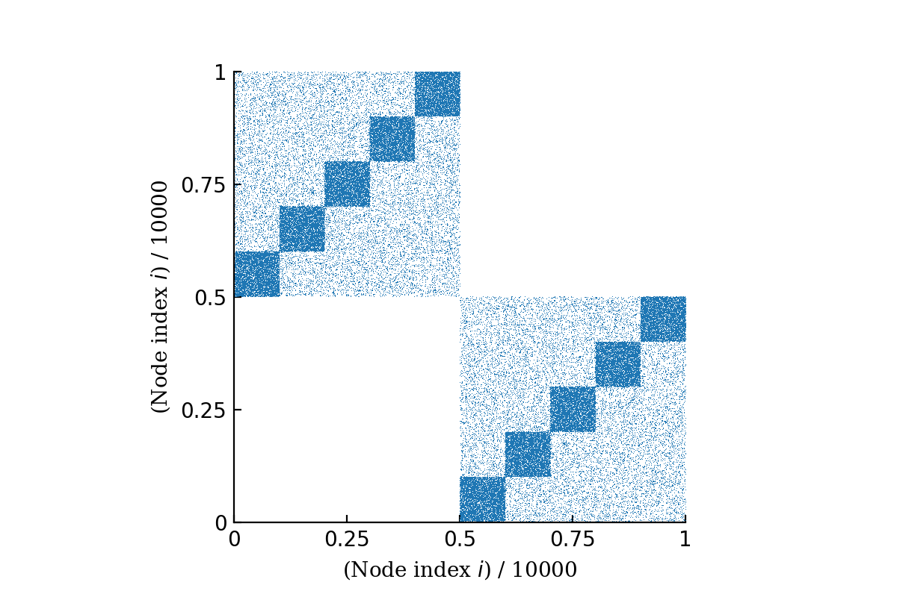
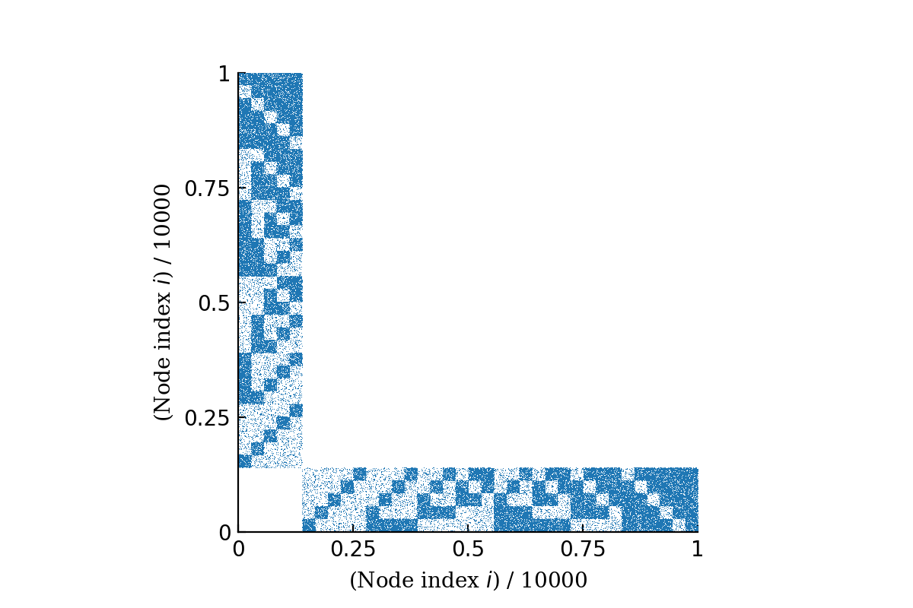
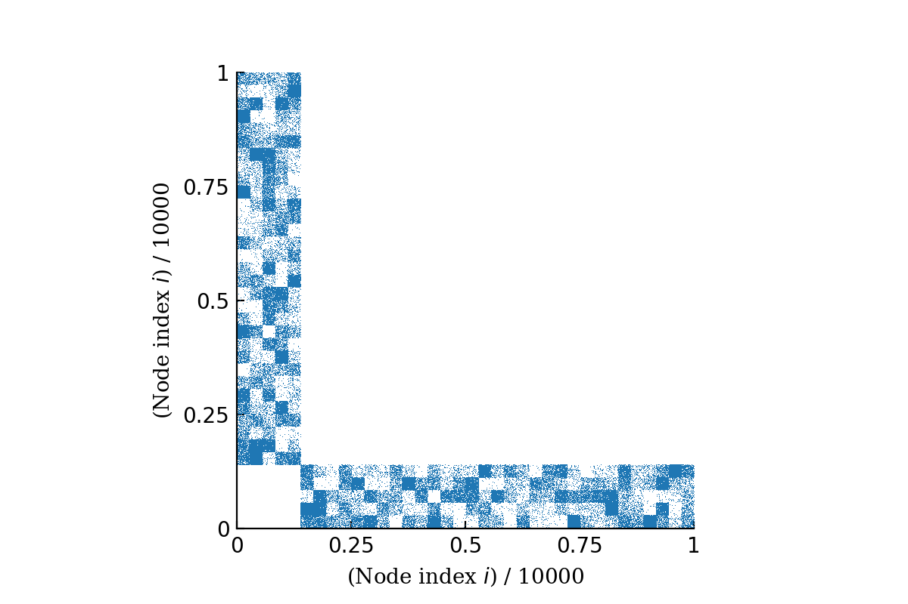

Generate synthetic networks
===========================

It is necessary to benchmark our algorithm via synthetic networks, where we have perfect confidence 
on the model parameters. Here we can control the nodes' block membership :math:`b`, the edge count matrix :math:`e_{rs}`,
and the degree distribution :math:`d`. Once we specified these 3 parameters,
we call `Graph-tool <https://graph-tool.skewed.de/>`_'s
`generate_sbm <https://graph-tool.skewed.de/static/doc/generation.html#graph_tool.generation.generate_sbm>`_ function to
generate a graph-tool graph instance,
and then use that instance as an input for our :class:`det_k_bisbm.optimalks.OptimalKs` class.

Block membership :math:`b`
--------------------------

Edge count matrix :math:`e_{rs}`
--------------------------------

Easy cases
~~~~~~~~~~
The easy cases are bipartite version of the planted partition models. It is a :math:`(K_a, K_b)`-bipartite structure
with :math:`e_{rs} = p c / K + (1 - p)(1 - c)/K(K-1)`, where :math:`K_a = K_b = K` and :math:`p = c_{out}/c_{in}` is a
parameter that controls how `crisp` the structure is. When :math:`p = 0`, we expect no connections at all between nodes
of different groups, i.e., :math:`e_{rs} = E \delta_{rs}/ K`.

   A easy case with :math:`\langle k\rangle = 10` and :math:`p=0.1`, planted as :math:`(K_a, K_b) = (5, 5)`
   equally-sized communities.

Hard cases
~~~~~~~~~~
The hard cases are planted networks where :math:`K_a \neq K_b`, but the edge count matrix is still
designed in a way that allow the control of network structural strength.

   A hard case with :math:`\langle k\rangle = 10` and :math:`p=0.1`, planted as :math:`(K_a, K_b) = (5, 31)`
   equally-sized communities.

Even harder cases
~~~~~~~~~~~~~~~~~
A even harder case is simply a random draw out of the ensemble of edge count matrices where we 
only fix :math:`K_a` and :math:`K_b`.

   A harder case with :math:`\langle k\rangle = 10`, planted as :math:`(K_a, K_b) = (5, 31)`
   equally-sized communities. This is the strongest structure out of :math:`10^6` random :math:`e_{rs}` draws.

Degree distribution :math:`d`
-----------------------------
